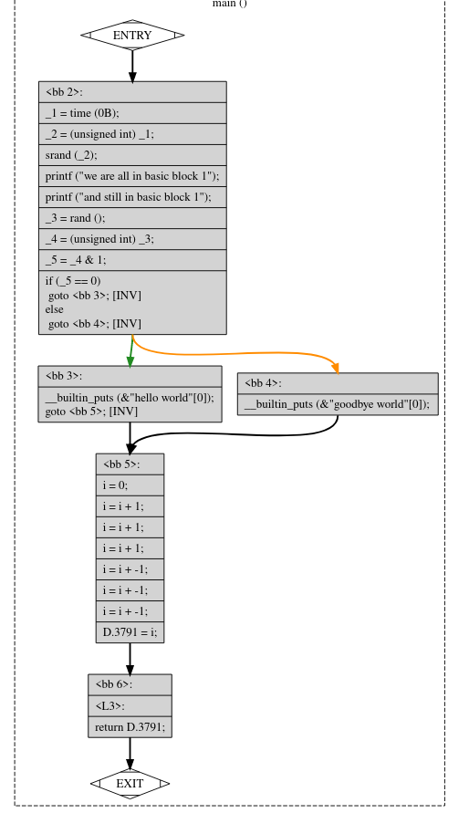
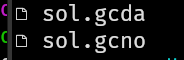
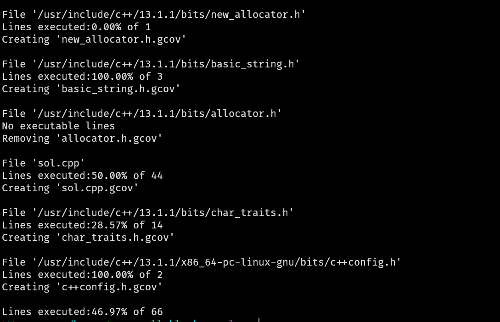
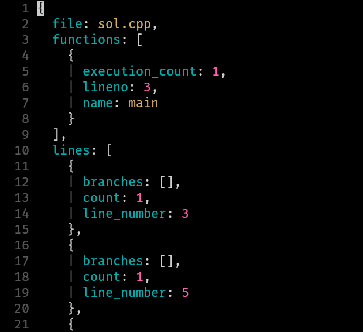
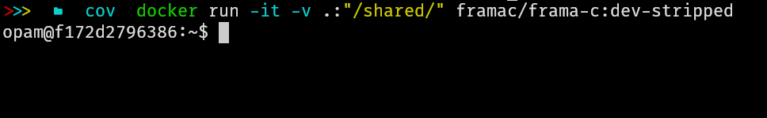
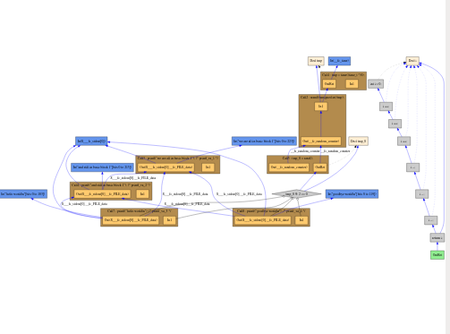
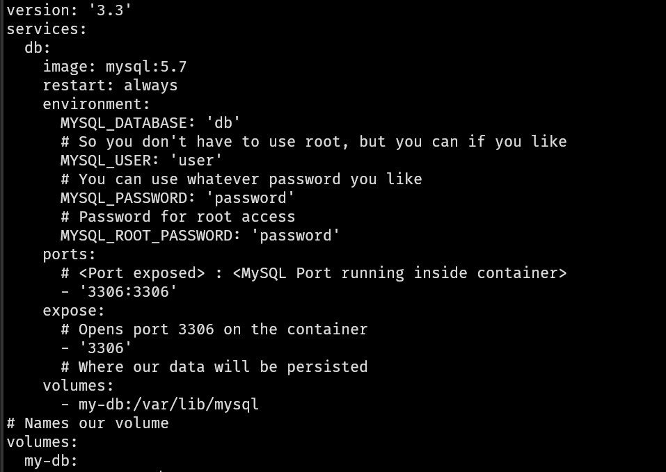

## گزارش پروژه‌ی نهایی درس تست/دیباگ و تعمیر خطا

### استاد: جناب آقای دکتر وحیدی

#### دانشجو:‌ روزبه شریف‌نسب - ۴۰۱۴۴۳۱۷۵


برای انجام پروژه نیاز به جمع‌آوری یکسری داده بود که هر کدام را به شکل جدا توضیح خواهم داد. همچنین تصمیمات زیر در پروژه گرفته شده است:

+ تحلیل گراف ها با کد پایتون و به کمک کتابخانه‌ی networkx انجام شده است. 
+ زبان مورد استفاده `C++ 14` بوده است که تعداد کدهای زیادی را شامل می‌شد. 
+ سوالاتی از بانک سوالات انتخاب شده اند که در زبان مورد نظر ما C++ 14 تعداد زیادی کد faulty و تعداد متوسطی تست کیس داشته باشند. 
+ کدهای خطاداری انتخاب شده اند که شباهت خوبی با کد سالم خود داشته باشند تا بتوان خطا را مکانیابی کرد. 
+ برای coverage از gcov و gcovr استفاده شده است
+ برای CFG از همان گراف خروجی gcov استفاده شده است با توجه به اینکه یال های بین BB ها نیاز نبود. 
+ برای CDG از llvm استفاده شده است: https://github.com/mchalupa/dg/blob/master/doc/CDA.md
+ برای DDG از angr استفاده شده است که به شکل باینری عمل می‌کند و بعد نتایج تبدیل شده اند. 


### بلوک‌های سازنده‌ی برنامه با GCC

قدم اول پیدا کردن گره‌های یک برنامه بودند که با ابزارهای مختلفی اقدام شد. اولین و ساده ترین راه استفاده از خود gcc است. این ابزار قدرتمند و سریع خودش می‌تواند گراف CFG را خروجی دهد. با کمک  دستور زیر فایل های مختلف ساخته می‌شود که چند تا از آن‌ها فایل‌های گراف vis هستند (.dot) و یک گراف را تصویر می‌کنند و  قابلیت تبدیل به pdf یا png یا postscript را دارند.

```bash
gcc -fdump-tree-all-graph -g -O0 sample.c -o sample
```

همانطور که در این دستور مشخص است خود gcc را فراخوانی می‌کنیم و از او می‌خواهیم که انواع گراف هایی که می‌تواند را تولید کند. 

در صورت اجرای این دستور خروجی های متنوعی ساخته می‌شود که در متن زیر می‌بینیم:

```bash
 sample.c.005t.original
 sample.c.006t.gimple
 sample.c.009t.omplower
 sample.c.010t.lower
 sample.c.013t.eh
 sample.c.015t.cfg
 sample.c.015t.cfg.dot
 sample.c.017t.ompexp
 sample.c.017t.ompexp.dot
 sample.c.020t.fixup_cfg1
 sample.c.020t.fixup_cfg1.dot
 sample.c.021t.ssa
 sample.c.021t.ssa.dot
 sample.c.022t.walloca1
 sample.c.022t.walloca1.dot
 sample.c.023t.warn-printf
 sample.c.023t.warn-printf.dot
 sample.c.024t.early_uninit
 sample.c.024t.early_uninit.dot
 sample.c.025t.waccess1
 sample.c.025t.waccess1.dot
 sample.c.029t.fixup_cfg2
 sample.c.029t.fixup_cfg2.dot
 sample.c.030t.local-fnsummary1
 sample.c.030t.local-fnsummary1.dot
 sample.c.031t.einline
 sample.c.031t.einline.dot
 sample.c.049t.profile_estimate
 sample.c.053t.release_ssa
 sample.c.053t.release_ssa.dot
 sample.c.054t.local-fnsummary2
 sample.c.054t.local-fnsummary2.dot
 sample.c.094t.fixup_cfg3
 sample.c.094t.fixup_cfg3.dot
 sample.c.101t.adjust_alignment
 sample.c.101t.adjust_alignment.dot
 sample.c.240t.veclower
 sample.c.240t.veclower.dot
 sample.c.241t.cplxlower0
 sample.c.241t.cplxlower0.dot
 sample.c.243t.switchlower_O0
 sample.c.243t.switchlower_O0.dot
 sample.c.250t.isel
 sample.c.250t.isel.dot
 sample.c.253t.waccess3
 sample.c.253t.waccess3.dot
 sample.c.254t.optimized
 sample.c.254t.optimized.dot
 sample.c.341t.statistics
 sample.c.342t.earlydebug
 sample.c.343t.debug
```


فایل های .dot برای ما کاربردی هستند چرا که ساختار machine readableی از گراف می‌دهند، مثلا از فایل `sample.c.015t.cfg.dot` استفاده می‌کنیم.  با مصورسازی این گراف به تصویر زیبای زیر می‌رسیم: 


برای یک برنامه‌ی خیلی ساده چنین تصویری ساخته می‌شود:




چالشی که در اینجا وجود دارد این است که علی‌رغم خوب مشخص شدن BB ها ولی شماره خط متناظر وجود ندارد و حتی خود دستورات ه در حالت ساده‌ی خود قرار ندارند بنابراین نمی‌توان در حالت source level از این ابزار استفاده کرد. 


در ادامه angr را نیز ملاحظه می‌کنیم که‌ آن هم مشکل مشابهی دارد. 


### ابزار Gcov

برای اینکه code coverage را در برنامه های C/Cpp خود بسنجیم ابزارهای چندان متنوعی در اختیار نداریم، اما برای اینکه باقی ابزارها مناسب بودند سعی شد تا راه حلی پیدا شود. راه حل پید شده Gcov بود. این ابزار که از خانواده ابزارهای گنو به شمار می‌رود و یکپارچگی خوبی نیز با GCC دارد راهگشا بود. همچنین برای پروژه های بزرگ نسخه‌ی تعمیم یافته ی این نرم افزار به نام lcov نیز در دسترس است. 

نحوه کار این ابزار به این شکل است که از gcc می‌خواهیم که زمان کامپایل کد ما را instrument کند. همچنین یکسری فایل های دیتابیس نیز می سازد. سپس هربار که برنامه اجرا می‌شود اطلاعات زمان اجرای خودش را به این دیتابیس اضافه می‌کند و فایل مربوطه کامل تر می‌شود. برای تحلیل این داده ها gcov به کار می‌آید و با گرفتن فایل دیتابیس آن را تحلیل می‌کند و برای هر buidling block اطلاعات متفاوتی را ارائه می‌دهد. 

نحوه کار به این صورت است:

```bash
gcc -fprofile-arcs -ftest-coverage --coverage  -g sample.c -o sample
```

با این دستور از gcc مي‌خواهیم که کد را instrument کند.

سپس کد را هر تعداد بار که می‌خواهیم اجرا می‌کنیم. البته در این پروژه فقط یک بار اجرا می‌کنیم چون به ازای هر تست کیس coverage را نیاز داریم نه coverage مجموع تست ها را. 

سپس برای گرفتن نتیجه از دستوری مانند زیر استفاده میکنیم:

```bash
gcov --all-blocks -j sample.c
```

آرگومان j به ما می‌گوید که یک json قرار است خروجی بگیریم که machine readable باشد. خروجی پیشفرض این ابزار اصلا readalbe نیست! 

دستور gcovr که باید به شکل جداگانه نصب شود یک ابزار report بر پایه ی خروجی های gcov است که آن هم می‌تواند خروجی های متنوعی مثل html/json/xml ارائه دهد. 

برای مثال می‌توان از چنین دستور استفاده کرد (همانطور که مشخص است نیازی به تصریح فایل مورد نظر وجود ندارد)

```bash
gcovr --json --exclude-throw-branches
```


فایل های ساخته شده توسط کد instrument شده:



یک نمونه خروجی gcovr




و فایل jsonی که برای تشخیص coverage استفاده شد: 

(به دلیل طولانی بودن اینجا اورده نمی‌شود)




همانطور که ملاحظه می‌شود برای هر line number مشخص است که اجرا شده یا خیر. 


### farma-c برای data dependency 

یکی از ابزارهایی که از تمرین ها با آن آشنا بودیم همین ابزار فارما سی بود. ابتدا تصمیم گرفتم که مانند تمرین ها آن را نصب کنم ولی موفق نشدم! سپس از ایمج داکر آن استفاده کردم 




با کمک دستوری شبیه به این دستور هم می‌توان pdg استخراج کرد ولی خوشبختانه نیازی به این روش نشد: 

```bash
frama-c -pdg -pdg-dot graph -pdg-print program.c
```

خروجی .dot فراما سی برای همین کد:

```dot
digraph G {
  rankdir=TB;
  node [style="filled", ];
  64 [label="Out(S___fc_stdout[0].__fc_FILE_data)", fillcolor="#FFCA6E",
      shape=box, ];
  66 [label="In1", fillcolor="#FFCA6E", shape=box, ];
  67 [label="Out(S___fc_stdout[0].__fc_FILE_data)", fillcolor="#FFCA6E",
      shape=box, ];
  68 [label="int i = 0;", fillcolor="#CCCCCC", shape=box, ];
  69 [label="i ++;", fillcolor="#CCCCCC", shape=box, ];
  70 [label="i ++;", fillcolor="#CCCCCC", shape=box, ];
  71 [label="i ++;", fillcolor="#CCCCCC", shape=box, ];
  72 [label="i --;", fillcolor="#CCCCCC", shape=box, ];
  73 [label="i --;", fillcolor="#CCCCCC", shape=box, ];
  74 [label="i --;", fillcolor="#CCCCCC", shape=box, ];
  75 [label="return i;", fillcolor="#CCCCCC", shape=box, ];
  43 [label="Decl tmp", fillcolor="#FFEFD5", shape=box, ];
  76 [label="OutRet", fillcolor="#90EE90", shape=box, ];
  44 [label="Decl tmp_0", fillcolor="#FFEFD5", shape=box, ];
  77 [label="In(S___fc_stdout[0])", fillcolor="#6495ED", shape=box, ];
  45 [label="Decl i", fillcolor="#FFEFD5", shape=box, ];
  78 [label="In(\"goodbye world\\n\"[bits 0 to 119])", fillcolor="#6495ED",
      shape=box, ];
  79 [label="In(\"hello world\\n\"[bits 0 to 103])", fillcolor="#6495ED",
      shape=box, ];
  47 [label="In1", fillcolor="#FFCA6E", shape=box, ];
  80 [label="In(\"and still in basic block 1\"[bits 0 to 215])",
      fillcolor="#6495ED", shape=box, ];
  48 [label="OutRet", fillcolor="#FFCA6E", shape=box, ];
  81 [label="In(\"we are all in basic block 1\"[bits 0 to 223])",
      fillcolor="#6495ED", shape=box, ];
  82 [label="In(__fc_time)", fillcolor="#6495ED", shape=box, ];
  50 [label="In1", fillcolor="#FFCA6E", shape=box, ];
  51 [label="Out(__fc_random_counter)", fillcolor="#FFCA6E", shape=box, ];
  53 [label="In1", fillcolor="#FFCA6E", shape=box, ];
  54 [label="Out(S___fc_stdout[0].__fc_FILE_data)", fillcolor="#FFCA6E",
      shape=box, ];
  56 [label="In1", fillcolor="#FFCA6E", shape=box, ];
  57 [label="Out(S___fc_stdout[0].__fc_FILE_data)", fillcolor="#FFCA6E",
      shape=box, ];
  59 [label="Out(__fc_random_counter)", fillcolor="#FFCA6E", shape=box, ];
  60 [label="OutRet", fillcolor="#FFCA6E", shape=box, ];
  61 [label="tmp_0 % 2 == 0", fillcolor="#CCCCCC", shape=diamond, ];
  63 [label="In1", fillcolor="#FFCA6E", shape=box, ];
  
  subgraph cluster_Call1 { label="Call1 : tmp = time((time_t *)0);";
                           fillcolor="#B38B4D"; style="filled"; 48;47;
     };
  subgraph cluster_Call2 { label="Call2 : srand((unsigned int)tmp);";
                           fillcolor="#B38B4D"; style="filled"; 51;50;
     };
  subgraph cluster_Call3 { label="Call3 : printf(\"we are all in basic block 1\"); /* printf_va_1 */";
                           fillcolor="#B38B4D"; style="filled"; 54;53;
     };
  subgraph cluster_Call4 { label="Call4 : printf(\"and still in basic block 1\"); /* printf_va_2 */";
                           fillcolor="#B38B4D"; style="filled"; 57;56;
     };
  subgraph cluster_Call5 { label="Call5 : tmp_0 = rand();";
                           fillcolor="#B38B4D"; style="filled"; 60;59;
     };
  subgraph cluster_Call7 { label="Call7 : printf(\"hello world\\n\"); /* printf_va_3 */";
                           fillcolor="#B38B4D"; style="filled"; 63;64;
     };
  subgraph cluster_Call8 { label="Call8 : printf(\"goodbye world\\n\"); /* printf_va_4 */";
                           fillcolor="#B38B4D"; style="filled"; 67;66;
     };
  
  edge [dir=back, ];
  54 -> 64 [label="S___fc_stdout[0].__fc_FILE_data", color="#0000FF", ];
  57 -> 64 [label="S___fc_stdout[0].__fc_FILE_data", color="#0000FF", ];
  61 -> 64 [color="#000000", arrowtail=odot, ];
  77 -> 64 [color="#0000FF", ];
  79 -> 64 [color="#0000FF", ];
  61 -> 66 [color="#000000", arrowtail=odot, ];
  54 -> 67 [label="S___fc_stdout[0].__fc_FILE_data", color="#0000FF", ];
  57 -> 67 [label="S___fc_stdout[0].__fc_FILE_data", color="#0000FF", ];
  61 -> 67 [color="#000000", arrowtail=odot, ];
  77 -> 67 [color="#0000FF", ];
  78 -> 67 [color="#0000FF", ];
  45 -> 68 [color="#000000", style="dotted", ];
  45 -> 69 [color="#0000FF", style="dotted", ];
  68 -> 69 [color="#0000FF", ];
  45 -> 70 [color="#0000FF", style="dotted", ];
  69 -> 70 [color="#0000FF", ];
  45 -> 71 [color="#0000FF", style="dotted", ];
  70 -> 71 [color="#0000FF", ];
  45 -> 72 [color="#0000FF", style="dotted", ];
  71 -> 72 [color="#0000FF", ];
  45 -> 73 [color="#0000FF", style="dotted", ];
  72 -> 73 [color="#0000FF", ];
  45 -> 74 [color="#0000FF", style="dotted", ];
  73 -> 74 [color="#0000FF", ];
  45 -> 75 [color="#0000FF", ];
  74 -> 75 [color="#0000FF", ];
  75 -> 76 [color="#0000FF", ];
  43 -> 48 [color="#000000", style="dotted", ];
  82 -> 48 [color="#0000FF", ];
  43 -> 50 [color="#0000FF", ];
  48 -> 50 [color="#0000FF", ];
  50 -> 51 [color="#0000FF", ];
  77 -> 54 [color="#0000FF", ];
  81 -> 54 [color="#0000FF", ];
  54 -> 57 [label="S___fc_stdout[0].__fc_FILE_data", color="#0000FF", ];
  77 -> 57 [color="#0000FF", ];
  80 -> 57 [color="#0000FF", ];
  51 -> 59 [label="__fc_random_counter", color="#0000FF", ];
  44 -> 60 [color="#000000", style="dotted", ];
  51 -> 60 [label="__fc_random_counter", color="#0000FF", ];
  44 -> 61 [color="#0000FF", ];
  60 -> 61 [color="#0000FF", ];
  61 -> 63 [color="#000000", arrowtail=odot, ];
  
  }
```



و نتیجه: 




در تصویر خوب مشخص نیست اما این ابزار هم چندان به سورس کد پایبند نماند. 


## angr

یک ابزار که روی فایل های باینری کار می‌کند ولی CFG/CDG/DDG را تولید می‌کند angr است. با پایتون هم سازگاری خوبی دارد. برای قسمت سوم یا همان DDG استفاده شد. چالشی که وجود دارد این است که روی اسمبلی کار می‌کند و ادرس های داخل بایت کد را تحوپیل می‌دهد. 

با کمک دستور addr2line و فعال کردن اطلاعات دیباگ توانستم به خطوط کد برسم و نهایتا از همین ابزار استفاده کردم. 


# DG

ابزارهای متنوعی بر پایه llvm برای استخراج DDG وجود داشتند ولی با توجه به تعدد نسخه های llvm کامپایل نمی‌شدند یا کار نمی‌کردند. یک ابزار که کار کرد این ابزار بود و با کمک آن CDG استخراج شد. البته برای PDG هم ابزار داشت ولی ارور می‌داد!


https://github.com/mchalupa/dg/blob/master/doc/CDA.md


### استخراج اطلاعات از دیتابیس

یکی از چالش های پروژه که چندان هم به چشم نمی‌آید، استخراج اطلاعات از دیتابیس است. ابتدا با کمک داکر یک mysql بالا آوردم و با کمک volume دیتای آن را persist کردم




سپس با کمک workbench نصب شده، به آن متصل شدن و دیتا را وارد دیتابیس کردم (import)

نکته‌ی کلیدی کوئری های مناسبی بود که نیاز بود زده شود و بعضا چندین join داشتند. به طور دقیق تر چالش اصلی پیدا کردن سوالات خوبی بود که تعداد زیادی حل کننده با cpp داشته باشند و تعداد تست کیس هایشان هم زیاد یا خیلی کم نباشد. همچنین حل کننده ها باید کد خطادار ارسال میکرده بودند وگرنه مورد قبول نبود! 

همچنین پیدا کردن یک کد خطادار مناسب بین همه ی کدهای خطادار که به آن سوال مربوط هستند هم چالشی بود. 


کوئری قسمت اول: 

```sql
SELECT
    problems.id,
    COUNT(DISTINCT testcases.id) AS testcase_count,
    COUNT(DISTINCT realfaultslocations_c_cpp.id) AS faulties_count
FROM
    problems
        JOIN
    source ON source.problems_id = problems.id
        JOIN
    languages ON source.languages_id = languages.id
        JOIN
    testcases ON testcases.problems_id = problems.id
        JOIN
    realfaultslocations_c_cpp ON realfaultslocations_c_cpp.subwrong = source.submission
WHERE
    languages.name = %s
        AND ((asimw > 70 AND wsima > 70)
        OR asimw > 90
        OR wsima > 90)
        AND matchlines > 20
        AND source.countLine > 20
        AND countfaults < 4
        AND source.verdicts_id = '2'
        AND testcases.isValid = 'pass'
GROUP BY problems.id
HAVING testcase_count > 19
    AND testcase_count < 60
    AND faulties_count > 1
ORDER BY faulties_count DESC
LIMIT 5

```


کوئری قسمت دوم:

```sql
SELECT
    subwrong,
    faultlocations,
    sourceCode,
    languages.name
FROM
    code4bench.realfaultslocations_c_cpp
        JOIN
    source ON source.submission = realfaultslocations_c_cpp.subwrong
        JOIN
    languages ON languages.id = source.languages_id
WHERE
    ((asimw > 70 AND wsima > 70)
        OR asimw > 90
        OR wsima > 90)
        AND matchlines > 20
        AND source.countLine > 20
        AND countfaults < 4
        AND source.verdicts_id = '2'
        AND source.problems_id = %s
        AND languages.name = %s
LIMIT %s

```


### ذخیره سازی داده ها

داده هایی که ذخیره می‌شد یکی همان گراف های ساخته شده بود که با کمک netowrkx ساخته می‌شد و سپس در gml ذخیره می‌شود که هم قابل ارائه در زمان ارائه را داشته باشد و هم با gephi باز شود. 

اما بعدا تصمیم گرفتم با networkx خودم تحلیل کنم. 


## تحلیل ها

گراف های ساخته شده در فایل زیپ ارسال مشخص هستند. 

خود گراف ها نیز با چنین دستوری قابلیت تحلیل دارند: 

```
./process_gml.py ./result/1488/type-1-1488.gml
```


این تحلیل که به طور نمونه اورده شده است برای گراف نوع اول سوال ۱۴۸۸ است: 

(شماره سابمیشن نیز مشخص است در فایل زیپ)


```

Type-1-1488 Graph N:100 E:198
|  avg degree: 3.96
|  density: 4.0000%
|  diameter: 2
|  effective diameter: 2.0
|  avg clustering coeff: 0.0000
|  Transitivity 0.0000
|  avg shortest path len 1.5184
|  assortativity (degree correlation) -1.0000
|  betweenness centrality test-5:0.00722 test-7:0.00722 test-10:0.00722 test-14:0.00722 test-15:0.00722 
|  pagerank centrality test-5:0.04444 test-7:0.04444 test-10:0.04444 test-14:0.04444 test-15:0.04444 
|  degree centrality test-5:0.22222 test-7:0.22222 test-10:0.22222 test-14:0.22222 test-15:0.22222 
|  closeness centrality test-5:0.23923 test-7:0.23923 test-10:0.23923 test-14:0.23923 test-15:0.23923 

```

